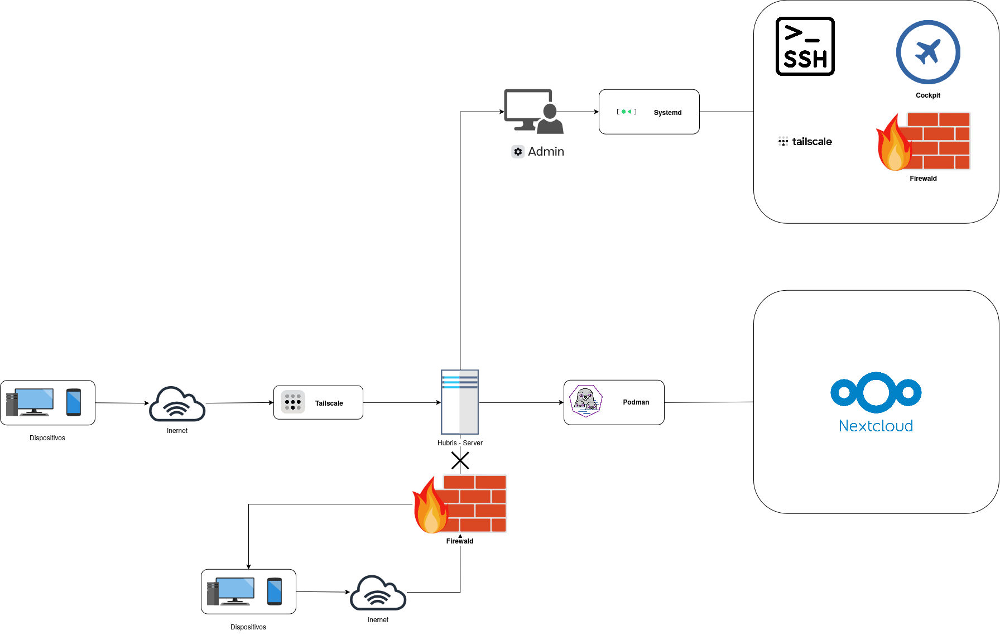

# Hubris - Personal Homelab
Hubris es un proyecto personal de homelab enfocado en constrir, documentar y administrar una infraestructura de servicio sobre un equipo reutilizado.
El proyecto utiliza un HP ProBook 440 G3 como servidor principal, ejecutando openSUSE Tumbleweed KDE, la idea es construir primero una infraestructura estable y comprender cómo funciona antes de añadir nuevos servicios.

## Objetivo
El objetivo principal de Hubris es convertir un equipo de uso general en una infreatructura doméstica capaz de alojar y administrar servicios propios.

El proyecto prioriza:
 - Administración sencilla.
 - Acceso remoto seguro.
 - Contenedores para los servicios.
 - Crecimiento progresivo.
 - Automatizaciones.

## Arquitectura
La infraestructura de Hubris se divide en diferentes capas encargadas del acceso, administración del sistema y la ejecución de servicios.

El acceso remoto al servidor se realiza mediante Tailscale. Una vez establecida la conexión, la administración del sistema requiere autenticación y los permisos correspondientes del usuario administrador.

Los servicios del sistema son gestionados mediante systemd, mientras que los servicios de usuario se ejecutan mediante contenedores administrativos con Podman.

Firewalld se encarga de controlar el tráfico de red que llega al servidor.

## Hardware utilizado

| Componente | Especificación |
|------------|----------------|
| Equipo | HP ProBook 440 G3 |
| CPU | Intel Core i7-6500U |
| RAM | 16 GB |
| Almacenamiento | SSD ~500 GB |
| Sistema | openSUSE Tumbleweed KDE |
